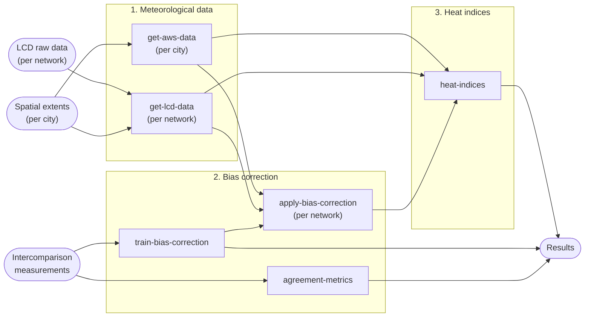

[](https://github.com/martibosch/swiss-uhi-lcd/blob/main/LICENSE)

# Revisiting urban heat indices in Switzerland using low-cost measurement networks

Materials to reproduce the results of the article *"Revisiting urban heat indices in Switzerland using low-cost measurement networks" (in preparation)*.

## Requirements

[Install pixi](https://pixi.sh/latest/installation). All other dependencies are managed automatically by pixi.

## Instructions to reproduce

The workflow is managed with [Snakemake](https://snakemake.readthedocs.io) and executes Jupyter notebooks via [papermill](https://papermill.readthedocs.io). To reproduce all results:

```bash
pixi run snakemake results --cores 1
```

Here is a schematic overview of the pipeline:



## Acknowledgments

- Based on the [cookiecutter-data-snake :snake:](https://github.com/martibosch/cookiecutter-data-snake) template for reproducible data science.
