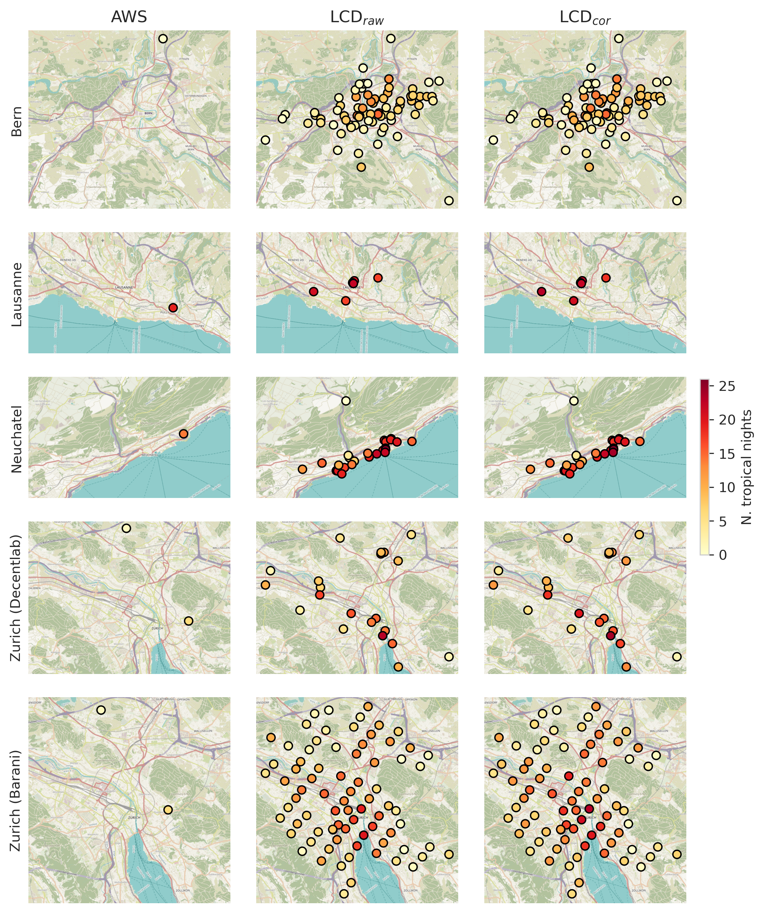
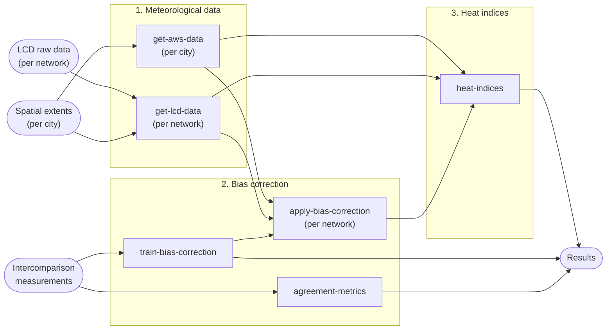

[](https://github.com/martibosch/swiss-uhi-lcd/blob/main/LICENSE)

# Revisiting urban heat indices in Switzerland using low-cost measurement networks

Materials to reproduce the results of the article *"Revisiting urban heat indices in Switzerland using low-cost measurement networks"* ([arXiv:2606.09364](https://arxiv.org/abs/2606.09364)).

Pre-trained bias correction model weights are available on the [Hugging Face Hub](https://huggingface.co/martibosch/lcd-bias-correction).



## Requirements

[Install pixi](https://pixi.sh/latest/installation). All other dependencies are managed automatically by pixi.

## Instructions to reproduce

The workflow is managed with [Snakemake](https://snakemake.readthedocs.io) and executes Jupyter notebooks via [papermill](https://papermill.readthedocs.io).

> **Note:** Before running the pipeline, download the URS dataset zip from [BORIS](https://boris-portal.unibe.ch/entities/product/c5fe9051-c7d9-482e-8a3a-56c0315bea4d) and place it in `data/raw/`. Snakemake will extract it automatically.

To reproduce all results:

```bash
pixi run snakemake results --cores 1
```

Here is a schematic overview of the pipeline:


```mermaid
flowchart LR
    raw_lcd(["LCD raw data\n(per network)"])
    raw_parallel(["Intercomparison\nmeasurements"])
    extents(["Spatial extents\n(per city)"])

    subgraph meteo ["1. Meteorological data"]
        get_aws["get-aws-data\n(per city)"]
        get_lcd["get-lcd-data\n(per network)"]
    end

    subgraph bias ["2. Bias correction"]
        agreement["agreement-metrics"]
        train["train-bias-correction"]
        apply["apply-bias-correction\n(per network)"]
    end

    subgraph indices ["3. Heat indices"]
        heat["heat-indices"]
    end

    raw_lcd --> get_lcd
    raw_parallel --> agreement
    raw_parallel --> train
    extents --> get_aws
    extents --> get_lcd
    get_aws --> apply
    get_lcd --> apply
    train --> apply
    get_aws --> heat
    get_lcd --> heat
    apply --> heat

    heat --> results(["Results"])
    train --> results
    agreement --> results
```

## Citation

```bibtex
@misc{bosch2026revisiting,
      title={Revisiting urban heat indices in Switzerland using low-cost measurement networks},
      author={Martí Bosch and Moritz Burger},
      year={2026},
      eprint={2606.09364},
      archivePrefix={arXiv},
      primaryClass={physics.ao-ph},
      url={https://arxiv.org/abs/2606.09364},
}
```

## Acknowledgments

- Based on the [cookiecutter-data-snake :snake:](https://github.com/martibosch/cookiecutter-data-snake) template for reproducible data science.
